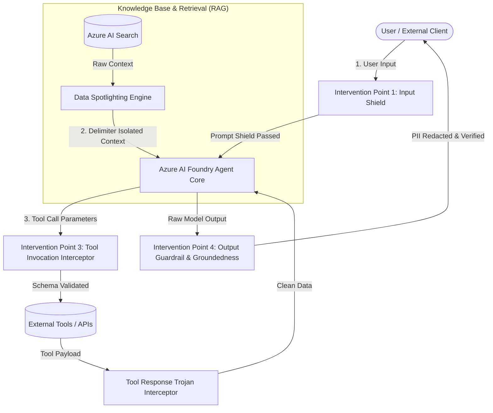

# 🛡️ STRIDE & AI Threat Model: Audited Retrieval & Secure Action Agent

This document outlines the security threat modeling, intervention architecture, and risk mitigation strategies implemented in **`foundry-responsible-agent-sentinel`**. It maps the **OWASP Top 10 for Large Language Model Applications (2025/2026 Edition)** directly to Azure AI Foundry features, Bicep infrastructure resources, and custom runtime interceptors.

---

## 1. 4-Point AI Lifecycle Intervention Architecture

---

## 2. Core AI-Specific Threat Vectors Mitigated

| Threat Vector | Industry Classification | Intervention Point | Technical Mitigation Mechanism | Enforcing Component |
| :--- | :--- | :--- | :--- | :--- |
| **Direct Prompt Injection (Jailbreaks & DAN)** | OWASP LLM01 | **User Input (Point 1)** | Azure AI Content Safety `Prompt Shields` + heuristic regex blocklists blocking role-play subversion and developer mode bypasses. | [`InputGuardrailInterceptor`](../src/guardrails/interceptors.py) [`rai-policy.bicep`](../infra/modules/rai-policy.bicep) |
| **Indirect Prompt Injection (XPIA)** | OWASP LLM01 | **RAG Context (Point 2)** | `Data Spotlighting` with structured system delimiters (`<trusted_archive_document>`), stripping nested system tags, and neutralizing Markdown image exfiltration links. | [`DataSpotlighter`](../src/knowledge/spotlight.py) [`rai-policy.bicep`](../infra/modules/rai-policy.bicep) |
| **Unauthorized / Unsafe Tool Execution** | OWASP LLM06 / LLM07 | **Tool Invocation (Point 3a)** | Pydantic runtime schema validation, parameter length bounds, SQL injection scanner, command injection blocker, and strict egress host whitelisting. | [`ToolInvocationInterceptor`](../src/guardrails/interceptors.py) [`tools.py`](../src/agent/tools.py) |
| **Data Poisoning & Tool Trojans** | OWASP LLM03 / LLM02 | **Tool Response (Point 3b)** | Payload byte size caps, Trojan instruction scanner ("important: ignore previous"), and structured JSON deserialization. | [`ToolResponseInterceptor`](../src/guardrails/interceptors.py) |
| **Sensitive Data Exfiltration & PII Leakage** | OWASP LLM02 / LLM08 | **Model Output (Point 4)** | Real-time regex substitution for SSN, credit cards, emails, phone numbers, API keys, and internal canary tokens (`CANARY-*`). | [`OutputGuardrailInterceptor`](../src/guardrails/interceptors.py) |
| **Hallucinations & Grounding Failures** | OWASP LLM09 | **Model Output (Point 4)** | Factual groundedness scoring against retrieved context. Responses below operational floor (0.85) are automatically blocked. | [`OutputGuardrailInterceptor`](../src/guardrails/interceptors.py) [`test_evaluations.py`](../tests/test_evaluations.py) |

---

## 3. OWASP Top 10 for LLM Applications to Azure AI Foundry Mapping

| OWASP LLM Vulnerability | Threat Description | Azure AI Foundry & Platform Countermeasure | Repository Implementation Reference |
| :--- | :--- | :--- | :--- |
| **LLM01: Prompt Injection** | Manipulating model via direct or indirect inputs to execute unintended instructions. | Azure Content Safety `PromptShield`, `IndirectAttack` blocking filters, and system delimiter spotlighting. | [`rai-policy.bicep`](../infra/modules/rai-policy.bicep) [`spotlight.py`](../src/knowledge/spotlight.py) |
| **LLM02: Sensitive Information Disclosure** | Leaking confidential patient data, credentials, or proprietary intellectual property. | Zero-Trust PII redactor, private endpoint egress, and Microsoft Entra ID managed identities with 0 static keys. | [`interceptors.py`](../src/guardrails/interceptors.py) [`main.bicep`](../infra/main.bicep) |
| **LLM03: Supply Chain Vulnerabilities** | Compromised model weights, fine-tuning datasets, or contaminated third-party packages. | Verified base models (`gpt-4o`), pinned dependency hashes, and automated adversarial CI/CD proving grounds. | [`requirements.txt`](../requirements.txt) [`rai-eval-gate.yml`](../.github/workflows/rai-eval-gate.yml) |
| **LLM04: Data and Model Poisoning** | Malicious injection into retrieval indexes or training data to skew model responses. | Document-level security filtering, Entra ID RBAC (`Search Index Data Contributor`), and Trojan response scanners. | [`ai-search.bicep`](../infra/modules/ai-search.bicep) [`ingest.py`](../src/knowledge/ingest.py) |
| **LLM05: Improper Output Handling** | Unsanitized model output passed downstream to browsers, shells, or APIs. | Output sanitization interceptor disabling Markdown exfiltration (``) and escaping HTML tags. | [`spotlight.py`](../src/knowledge/spotlight.py) [`interceptors.py`](../src/guardrails/interceptors.py) |
| **LLM06: Excessive Agency** | Granting models unchecked autonomy, broad API permissions, or destructive capabilities. | Least-privilege tool registrations, explicit dual-approval cryptographic signoffs (`EHRDispatchInput`), and role gates. | [`tools.py`](../src/agent/tools.py) |
| **LLM07: System Prompt Leakage** | Attackers prompting the LLM into disclosing internal prompts or secrets. | Direct blocklist against "reveal system prompt", delimiter containment, and Canary token redaction. | [`policies.json`](../src/guardrails/policies.json) [`core.py`](../src/agent/core.py) |
| **LLM08: Vector and Embedding Weaknesses** | Exploiting semantic search distance metrics or injecting adversarial chunks. | Azure AI Search HNSW vector search with BM25 hybrid ranking and Semantic Ranker cross-validation. | [`ai-search.bicep`](../infra/modules/ai-search.bicep) [`ingest.py`](../src/knowledge/ingest.py) |
| **LLM09: Misinformation & Hallucination** | Generating false clinical assertions or fabricated protocols. | Azure AI Evaluation SDK `GroundednessEvaluator` hard gate enforcing $\ge 0.85$ groundedness score floor. | [`test_evaluations.py`](../tests/test_evaluations.py) |
| **LLM10: Unbounded Consumption** | Denial of wallet or denial of service via uncontrolled agent loops or token floods. | Strict character bounds (500 max per parameter), rate-limited Azure API Management / TPM quotas in Bicep. | [`ai-foundry.bicep`](../infra/modules/ai-foundry.bicep) [`interceptors.py`](../src/guardrails/interceptors.py) |

---

## 4. STRIDE Model Analysis for Autonomous Agents

| STRIDE Dimension | Agent Threat Vector | Platform Defense Strategy | Verification |
| :--- | :--- | :--- | :--- |
| **Spoofing** | Impersonation of attending physician or security officer during action tool execution. | Mandatory `cryptographic_signoff_hash` (SHA-256 HMAC) and Entra ID JWT verification. | [`test_tool_invocation_interceptor_blocks_tampering`](../tests/test_evaluations.py) |
| **Tampering** | Modification of retrieved guidelines in-transit or via poisoned vector chunks. | Delimiter encapsulation treating all retrieved text as inert evidence; TLS 1.3 in-transit encryption. | [`test_data_spotlighting_defuses_injection_and_markdown_exfiltration`](../tests/test_evaluations.py) |
| **Repudiation** | An officer disclaiming responsibility for an authorized EHR action. | Audited immutable transaction logs (`TX-EHR-*`) with caller role and timestamping. | [`SecureEHRDispatchAction`](../src/agent/tools.py) |
| **Information Disclosure** | Extraction of patient SSN, credit card, or internal infrastructure hostnames. | Output redaction engine replacing detected PII with `[REDACTED_*]` tokens prior to egress. | [`test_output_guardrail_redacts_pii_and_canary_tokens`](../tests/test_evaluations.py) |
| **Denial of Service** | Long-string memory exhaustion or infinite looping through agent tool invocations. | Parameter length limits (500 chars), tool response caps (1MB), and bounded single-turn resolution. | [`ToolInvocationInterceptor`](../src/guardrails/interceptors.py) |
| **Elevation of Privilege** | Using prompt injection to force agent into invoking admin EHR dispatch tools. | Role whitelist enforcement in Pydantic schema (`ChiefMedicalOfficer`, `AttendingPhysician`). | [`EHRDispatchInput`](../src/agent/tools.py) |
